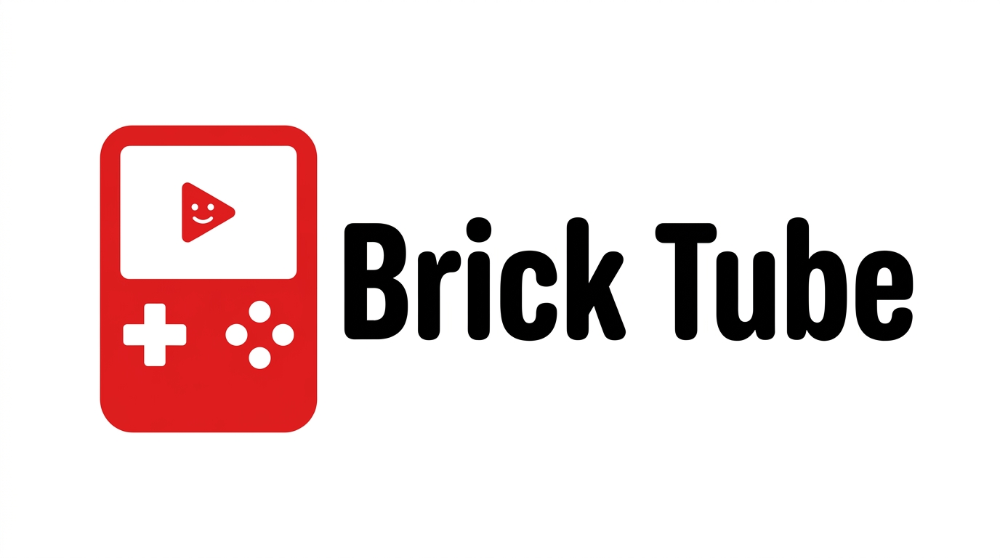

<p align="center">
  
</p>

<p align="center">
  <b>YouTube on a TrimUI Brick. Untethered. Hardware-decoded. Slightly cursed.</b>
</p>

---

The Brick is a lovely little slab of a handheld with no business playing YouTube.
It has no browser worth the name, no YouTube app, a 4:3 screen, a mono speaker
that sounds like it's phoning it in, and a locked-down vendor video stack with
zero documentation. So naturally: here is YouTube on it, over Wi-Fi, with no
computer in the loop, decoded by the actual video hardware.

You search, you get a wall of thumbnails, you press A, it plays. That's the whole
pitch. Everything under the hood was a small adventure.

## Install

You need a **TrimUI Brick running NextUI** (platform `tg5040`) and Wi-Fi. That's it —
no computer stays in the loop after install.

1. Grab the latest **`BrickTube-vX.Y.Z.zip`** from the [Releases](../../releases) page.
2. Unzip it. You get two folders: **`Tools`** and **`Videos`**.
3. Copy both into the **root of your SD card**, merging with the folders already
   there. (Your computer will ask about merging — choose merge / keep both. It only
   *adds* files, it doesn't replace your games or videos.)
4. Put the card back in the Brick and reboot.
5. Make sure Wi-Fi is on (NextUI settings).
6. Open **Tools → Brick Tube**. Search, pick a thumbnail, press A.

First launch each boot shows a ~2s "Preparing..." while it unpacks `yt-dlp` into RAM.
That's normal, and only once per boot.

**Uninstall:** delete `Tools/tg5040/Brick Tube.pak`, `Tools/tg5040/.media/Brick Tube.png`,
and the Brick Tube files from `Videos/` (`yt-dlp`, `ytdlp-onedir.tgz`, `ytproxy`,
`ytsearch`, `ytctl`, `minui-grid`, `minui-keyboard`, `minui-list`, `minui-presenter`,
`libyt_*.so`, `audiofix.conf`, `logo-corner.png`).

> **Brick only, for now.** The letterbox fix is specific to the Brick's Allwinner
> display hardware, so this is `tg5040`-only. It won't work as-is on other NextUI
> devices.

## What it does

- **Search + a real thumbnail grid.** Type a query, get a 3-wide grid of results
  with thumbnails, D-pad around, A to play. Recent searches are remembered.
- **Live, hardware-decoded playback.** No downloads, no re-encoding — the stream
  goes straight into the Allwinner CedarX video decoder. The CPU basically sits
  there filing its nails.
- **Correct aspect ratio.** 16:9 video is letterboxed properly on the 4:3 panel
  instead of being stretched into a funhouse mirror.
- **Pause with a timestamp bar**, volume that doesn't rudely stop the video, and a
  MENU button that stops cleanly instead of leaving a ghost layer on screen.
- **Warmer speaker.** A tiny EQ takes the edge off the tinny mono driver.
- **A menu** with a visual how-to, an about screen, and "clear recent searches".

## How it works (a.k.a. the fun part)

```
Recents / keyboard  ->  ytsearch (YouTube innertube, ~1s + thumbnails)
   ->  minui-grid (thumbnail picker)
   ->  yt-dlp resolves a real stream URL
   ->  ytproxy  (a tiny Go http<->https bridge, because the vendor player only speaks http)
   ->  tplayerdemo  (the vendor player)  ->  CedarX hardware decode  ->  your eyeballs
```

A few things that were **not** obvious and cost real hair:

- **The vendor player only speaks HTTP.** googlevideo is HTTPS-only. The device
  ships no CA bundle. So there's a 60-line Go proxy that bridges http to https and
  skips cert verification, purely on localhost. That was the whole ballgame for
  getting a stream to play at all.
- **The stretched video was the boss fight.** The player draws the video on its
  own display layer and ignores every documented way to resize it. The fix is an
  `LD_PRELOAD` shim that intercepts the player's `ioctl()` calls to `/dev/disp`
  and rewrites the on-screen rectangle out from under it. Found the exact ioctl by
  logging every call the player made until the screen stopped lying.
- **It got fast.** Search went from ~15s to ~3s by calling YouTube's internal
  search API directly in Go instead of booting Python. `yt-dlp` startup dropped
  from 4.5s to 1.7s by shipping it as an unpacked tree in RAM instead of a
  self-extracting blob.
- **The speaker EQ** is another `LD_PRELOAD` shim, this time on the audio path,
  running a couple of biquad filters on the PCM because the codec has no EQ of its
  own. Tunable from a text file on the card.

## The bits

| Path | What it is |
|---|---|
| `pak/` | the NextUI pak — `launch.sh` glues everything together |
| `search/` | `ytsearch` — Go innertube search + concurrent thumbnail fetch |
| `minui-grid/` | the 3-wide thumbnail grid (a fork of minui-list) |
| `proxy/` | `ytproxy` — the http<->https bridge |
| `ytctl/` | gamepad -> player controller (pause, stop, the pause overlay) |
| `rectfix/` | `libyt_rectfix.so` — the display-rectangle ioctl shim |
| `audiofix/` | `libyt_audiofix.so` — the speaker warmth EQ |
| `assets/` | logo, splash, help art |

Build + deploy notes live in [`HANDOFF.md`](HANDOFF.md).

## Honest limitations

- **No forward scrubbing.** The vendor player only buffers a few seconds of a live
  stream and physically will not seek past it. Rather than ship a fake seek bar,
  it's gone. (Full seeking would mean downloading the whole file first, which trades
  away the instant-play feel. Maybe later.)
- **360p, mostly.** True 720p needs an on-device DASH remux, which is a project for
  another rainy afternoon.
- **It will break.** YouTube changes things; `yt-dlp` catches up. That's the deal
  with tools like this.

## Legal, briefly

Personal hobby project. Not affiliated with YouTube or Google. It hosts no video,
downloads nothing to redistribute, and just plays public streams on your own
device for your own eyeballs. Full text in [`DISCLAIMER.md`](DISCLAIMER.md). Be
nice, respect copyright, don't be weird about it.

## Standing on shoulders

- [minui-keyboard / minui-list / minui-presenter](https://github.com/josegonzalez) — MIT
- [yt-dlp](https://github.com/yt-dlp/yt-dlp) — Unlicense
- [NextUI](https://github.com/LoveRetro/NextUI) — the handheld OS this rides on

MIT licensed. See [`LICENSE`](LICENSE). Made by navneeth, for the joy of making a
brick do something it was never supposed to.
